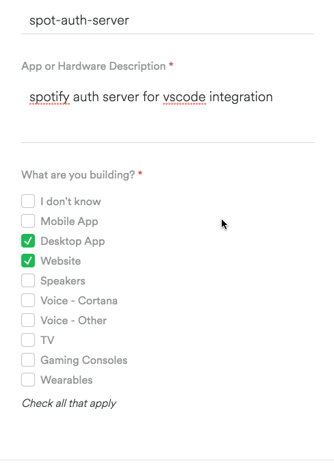
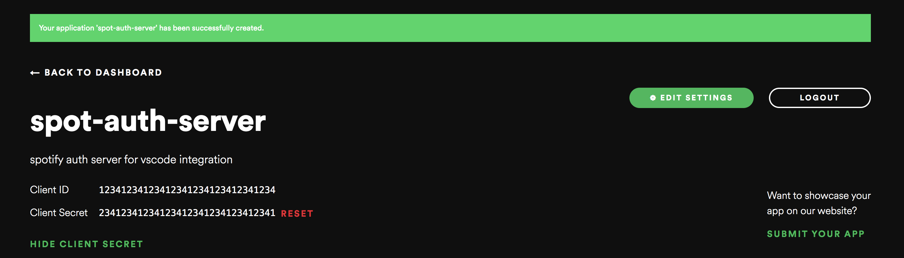
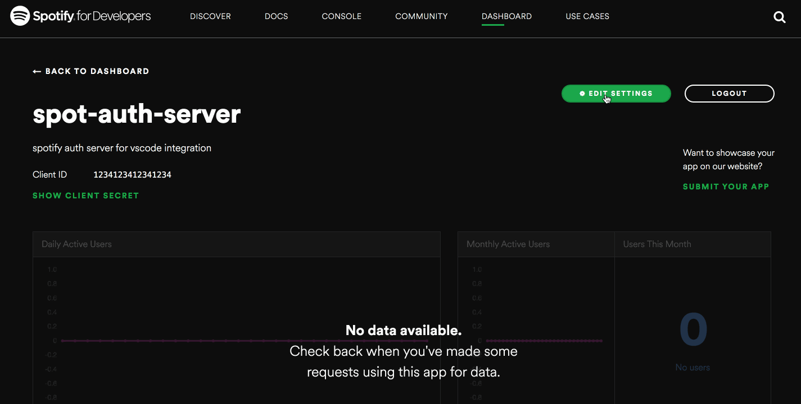

# vscode-spotify-auth 
Spotify api auth server for vscode-spotify

## How to run your own auth server.

### Create Spotify Integration App
Log in into https://developer.spotify.com/dashboard/applications . Create new Spotify integration.

Take a note of Client ID and Client Secret. We'll need it later.

If you know your domain name now you can add a callback url for the integration now. 

### Deploy your own auth server.
For auth server to work properly you need to override 3 env variables: 

* SPOTIFY_CLIENT_ID - the value of the Client ID from [Create Spotify Integration App](#create-spotify-integration-app).
* SPOTIFY_CLIENT_SECRET - the value of the Client Secret from [Create Spotify Integration App](#create-spotify-integration-app).
* SPOTIFY_REDIRECT_URI - the value of the callback from [Create Spotify Integration App](#create-spotify-integration-app). (For example https://your-auth-server.com/callback)
* FINAL_REDIRECT_URI - the value of the url of the temporary server that's created by vscode-spotify. (By deafault this should be http://localhost:8350 ).

If you have a Microsoft Azure subscription, you can deploy it via azuredeploy button at the top of this README. If you are using some other cloud provider or baremetal solution you should follow instructions for deploying nodejs server.
